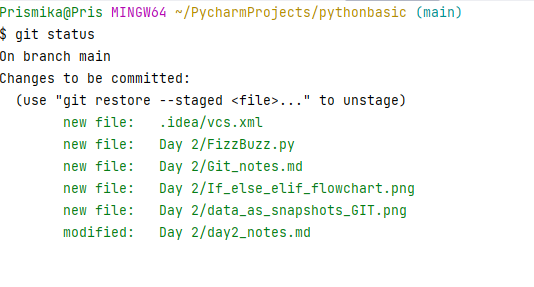
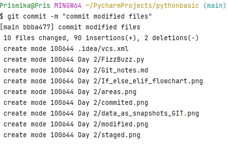

## Git 

#### What is Git?
Git is an open source distributed version control system (VCS) designed to handle everything from small to very large projects with speed and efficiency. 
  

Through this we are able to track changes and manage files. Git does not store data in a file based system, it stores information in the form of snapshots.
 

 _Storing data as snapshots of the project over time_

## The Three States 
Git has three main states that your file can reside in: 

### **Modified**

This means that when you make changes to a file in your Git repository, it becomes "modified" because it contains new changes compared to the version that was last committed. These changes have not yet been saved to the staging area.
 

Examples of modified files:

### **Staged**

Staging is the step before committing your changes. This is where you prepare your files to be included in the next commit. When you have made changes to a file, and you want to include those changes in the next commit, you 'stage'the file. 
 

Example of staged files on git:

### **Committed** 

After you have staged your changes, you commit them. This means you are taking a snapshot/ saving of the current state of your project, including all staged changes. These changes are now saved in the Git repository and can be accessed anytime. 
  

Examples of committed files:

The three main sections of a Git project: the working tree, the staging area, and the Git directory. 
 

  
_Working tree, staging tree and Git directory_ 

The basic Git workflow goes like this: 
1. You modify file in your working tree. 
2. You selectively stage the changes you want to commit next, this only adds those changes in the staging area. 
3. You do a commit, which takes the file as they are from the staging area and stores that snapshot permanently to your Git directory. 

#### Useful commands 
`ls` - list out all the folders.

`Pwd` - to show which directory you are on. 

`cd` - change directory - takes you to home directory.

`cd ..` - takes you one folder back.

`git init` - creates a new Git repository. (creates a .git subdirectory)

`ls -a` - shows hidden folder. 

`git status` - displays the state of the working directory and the staging area.It lets you see which changes have been staged, which haven't, and which files aren't being tracked by Git. 

`git add` - adds a change in the working directory to the staging area. 

`git add .` - adds all the files.

`git commit -m ""` - this commits your files. 

`git log` - used to view the history of committed changes within a Git repository.

`grep` -  used in searching and matching text files contained in the regular expressions.

`rm` -  removes the entries for a specified file, group of files, or certain select files from a list within a directory.

`mkdir`- allows the user to create directories.

