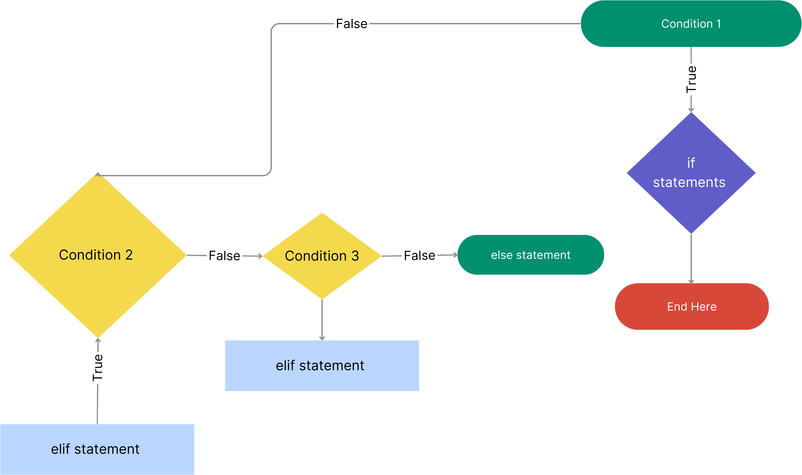

### Control Flow 
#### What is a Control Flow? 
Controls the flow of your code (make decisions). You can break it up and ignore certain code dependent on certain factors. 
<br> 
Is a statement to check if conditions are true before you run a piece of code. Each control flow statement you can think of it as a boolean.
<br>
`if`, `elif`, `else`
<br> 
- **Equals:** a == b
- **Not Equals**: a != b
- **Less than:** a < b
- **Less than or equal to**: a <= b
- **Greater than**: a > b 
- **Greater than or equal to**: a >= b

### If
The if statement evaluates condition.
If condition is evaluated to True, the code inside the body of if is executed. If condition is evaluated to False, the code inside the body of if is skipped.
<br>
### Elif 
Elif condition is used to include multiple conditional expressions after the if condition or between the if and else conditions.

### Else 

The else keyword catches anything which isn't caught by the preceding conditions.


<br> 
Flowchart showing if, elif and else statements. 

<br>
<br>
Example of if, elif and else statement:
<br>

```python
film_rating = "u"

# we have used the if statement to start with to allow conditional execution of a statement based on the value of the expression.
if film_rating.lower() == "u":
    print("All age groups can watch this movie")
    
    # elif- use instead of lots of if statement  - less processing power and runs only if 'if' condition is not met.
elif film_rating.lower() == "pg":
    print("Parental guidance is advised for this movie")
elif film_rating.lower() == "12" or film_rating.lower() == "12a":
    print("People aged 12 or over can watch this film unsupervised. Younger people must be supervised.")
elif film_rating.lower() == "15":
    print("People aged 25 or over can watch this movie.")
elif film_rating.lower() == "18":
    print("People aged 18 can watch this movie.")
# else
else:
    print("This is not a valid rating, please use 'u', 'pg','12' or '12a, '15, '18'.")
```
The output should show based on the value we have entered:
```
All age groups can watch this movie
```


### Activity 
Adding control flow to BMI calculator.

```python
# Convert the input string to float
height = float(input("Enter your height in cm: "))
weight = float(input("Enter your weight in kg: "))

# Dividing the height by 100 to convert the cm to m
BMI = weight / (height/100)**2
print("Your BMI is",BMI)

#print statement to state the current health based on BMI
if BMI <= 18.5:
    print("You are underweight.")
elif BMI <= 24.9:
    print("You are healthy.")
elif BMI <= 29.9:
    print("You are over weight.")
else:
    print("You are obese.")
```
Creating an odd or even number checker.

```python
# to check if the input number is odd or even
num = int(input("Enter a number: "))
#if a number is divisable by 2 then it is even. Using the remainder operator % helps us calculate the remainder. if the remainder is not 0 then it is a odd number.
mod = num % 2

if mod > 0:
    print("This is an odd number.")
else:
    print("This is an even number.")
```
### For Loops

A for loop is used for iterating over a sequence (that is either a list, a tuple, a dictionary, a set, or a string).With for loop we can execute a set of statements, once for each item in a list, tuple, set etc.

Example
<br> 
```python
list_data = [1, 2, 3, 4, 5]

#for all the num in the list_data, it will * 2 and print the output in a sequential process. 
for num in list_data:
    print(num * 2)
```
The output: 
```
2
4
6
8
10

```
Example 2: 
```python
embedded_lists = [[1, 2, 3], [4,5,6]]


for data in embedded_lists:
    print(data) #prints out what's currently inside the data
    
    #print what's currently inside data.
    for num in data:
        print(num)
```