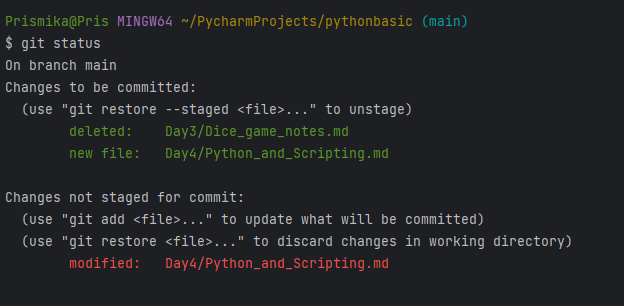
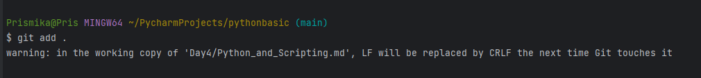
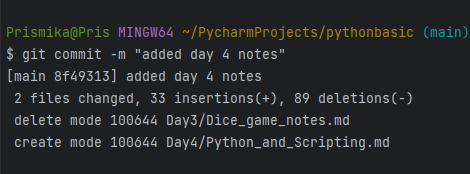
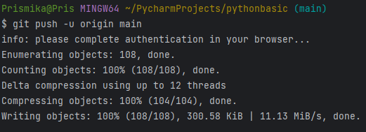

### Pushing repository to GitHub using Git

*Step-by-step instructions showing how to push your existing repository to GitHub using Git.*

1) Firstly you want to check if you have committed all your files into your repository.  You do this my opening up your Git Bash terminal on PyCharm and use the `git status` command in order to display the state of the working directory and the staging area. 

**Example:** 



The screenshot shows that I am currently on the branch main and there are some changes I need to commit as well as changes that needs to be staged. I will do this before I push this repo to GitHub.

2) Secondly, I type  the `git add .`  command in order to stage my changes so they  are ready to be committed. 

Example: 



3) Then I will finally type the `git commit -m  ""`in order to commit my changes into the repository. 

Example: 



This shows that all my modified files have successfully been committed. 

***Pushing repository to GitHub using Git***

4) Now, that we have finally committed all our changes into the repository, we are ready to push it to GitHub. We type in the command `$ git remote add origin` [https://github.com/Pxxmie/tech254_python.git](https://github.com/Pxxmie/tech254_python.git) (your GitHub)  then we press enter. If it does not come up with any errors then this means it has successfully ran the command. 

Example:

```bash
Prismika@Pris MINGW64 ~/PycharmProjects/pythonbasic (main)
$ git remote add origin https://github.com/Pxxmie/tech254_python.git
```

5) We will then rename the default branch from “master” to “main”. By using the `$ git branch -M main` command your default branch will be renamed and this change is local to your repository. 

Example:

```bash
Prismika@Pris MINGW64 ~/PycharmProjects/pythonbasic (main)
$ git branch -M main
```

6) Finally, we will push out the existing repository by typing the command `$ git push -u origin main` . The  `-u` is used to set the upstream branch, which means that in the future you can use just use git push without specifying the branch name, and Git will know which branch to push to. 

This command will update the remote repository with the changes you've made in your local **`main`** branch.

Example:

